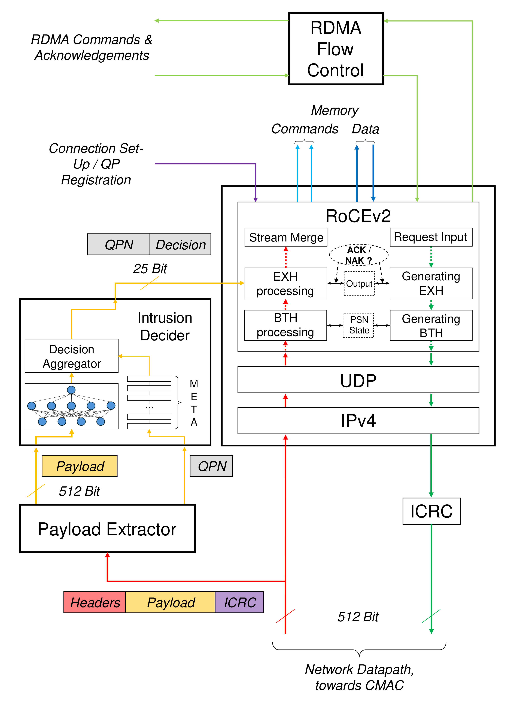
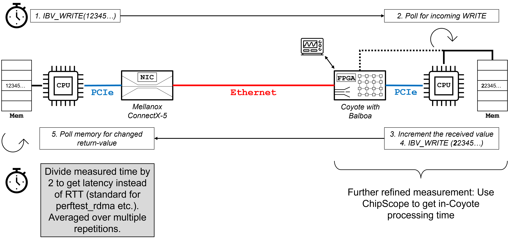

# RoCE Balboa - Payload-based Intrusion Detection for RDMA-traffic with ML-models
Our contribution to the AMD Open Hardware Contest: A ML-based Deep Packet Inspection for RDMA-networking on FPGAs.

## General description of the project 
Building on the open-sourced Coyote-shell (https://github.com/fpgasystems/Coyote/tree/coyote_v1) and the also open-sourced fully RoCE-v2 compatible RDMA-networking stack for FPGAs (https://github.com/fpgasystems/fpga-network-stack) our contribution to the Open Hardware Competition 2024 is a Machine-Learning based Deep Packet Inspection for RDMA on FPGAs, that directly addresses some of the most prominent security flaws of the RoCE-protocol and leverages the stream-processing capabilities of reconfigurable architectures. As a result, our design is reliable in the detection of x86-executables in RDMA-payloads at linerate in 100 Gbps-networks. 

RDMA (Remote Direct Memory Access) was originally developed as networking protocol for High-Performance Computing. Later, it found widespread usage in cloud computing, especially as RDMA over Converged Ethernet (RoCE). However, its background in the trustworthy domain of HPC and the essential RDMA-feature of OS-bypassing turn this protocol into a potential threat in public cloud settings. Our idea is to move central aspects of access control - in this case the prevention of transmission of potentially malicious executables - in the FPGA-based NICs to combine the original performance-advantages of RDMA with a higher level of security and control for the user. 

The main contributions of this project include the selection of adequate Machine Learning-models, the training and evaluation of such as well as the implementation of these models for deployment of FPGA-fabric via a cutting-edge open-source tool (https://github.com/fastmachinelearning/hls4ml). On the hardware-infrastructure side, this project builds on the implementation of a high-performance packet-processing pipeline for the integration of the customized ML-module as well as the adaptation of the control-plane of a highly advanced RDMA-stack for FPGAs. 

<picture>
    
</picture>

Thus, our main contribution is the integration of a Ml-based DPI for the detection of potentially malicious executables in packet payloads at line rate in network traffic. The relevant added files to the existing design can be found at `/artifacts/coyote-experiments/hw/hdl/network/rdma` and include `intrusion_detection_decider.sv`, `common/payload_extractor.sv` and all the `myproject_*.sv`-files. Adaptations were necessary to `roce_stack.sv` as well as for the HLS-implementation of the RDMA-packet processing pipeline in `/artifacts/coyote-experiments/hw/services/network/hls/rocev2`. 
As required for this competition, we paid great attention to the "openness" and re-usability of our design: Since our hardware-stack communicates via the standardized AXI4-Stream-interface at 512 Bit width and looks at raw payloads to generally detect x86-executables, it can easily be adopted to any kind of FPGA-based networking stack for Deep Packet Inspection as well as in other security-related domains of data-stream computing. 

## Hardware Prerequisites 
Since this project is built around a networking service, at least two connected servers are required for the replication of our experiments. Switched networks are acceptable and have been extensively tested. The targeted FPGA-platform is a `Alveo U55C`-accelerator card, connected via PCIe to the server. For our experiments about the cross-compatibility of our design in heterogeneous networking setups a dedicated ASIC-based NIC is required - our provided programs and scripts target a `Mellanox Connect-X5` card. 
On the software side, we developed the hardware using the `Vivado 2022.1` suite - licenses for the `Vivado / Vitis platform` are required to build and deploy our design. Furthermore, the [UltraScale+ Integrated 100G Ethernet Subsystem](https://www.xilinx.com/products/intellectual-property/cmac_usplus.html) license is required for the networking functionality. On top of that, the typical Linux-utilities such as fairly recent versions of cmake, gcc and python are used for various parts of the build process of our project. 
In general, we recommend to obtain a user account with the ETH HACC-cluster (https://github.com/fpgasystems/hacc), which has 10 network-attached compute nodes with U55C-cards and Mellanox-NICs. These servers have been used for the development and testing of this project, and our pre-configured build-script are mostly customized for the use with these instances. 

## Introduction on how to build Coyote
The entire project for deployment of the design on the FPGAs, including the drivers and the required Systems software can be found at `artifacts/coyote-experiments`. A pre-built bitstream for the U55C-platform is included in `artifacts/coyote-experiments/prebuilt_bitstream` to avoid long building times. However, instructions for building a new bitstream are included here as well: 

#### Building the Coyote-shell with RDMA and DPI 
###### Create a build directory :
~~~~
$ cd hw && mkdir build && cd build
~~~~
###### Set up the build-files for Coyote with RDMA 
~~~~
$ cmake .. -DFDEV_NAME=u250 -DEXAMPLE=perf_rdma_host
~~~~
###### Build the Coyote-shell
~~~~
$ make shell
~~~~
###### Build the user logic against the shell:
~~~~
$ make compile
~~~~

#### Building the Coyote-driver
~~~~
$ cd driver && make
~~~~

#### Building the Software
We generally showcase two experimental set-ups: Latency and throughput are tested between two servers both using a U55C-FPGA as NIC, while a one-shot demonstration of the DPI-capabilities is run between a FPGA-NIC on one side and a Mellanox-Card on the other. See also the next chapter for more information on this. 

###### SW for Coyote-Coyote benchmarking 
~~~~
$ cd sw && mkdir build && cd build
$ cmake ../ -DTARGET_DIR=examples/perf_rdma
$ make
~~~~

###### SW for Mellanox-Coyote DPI-demonstration 
~~~~
$ cd sw && mkdir build && cd build
$ cmake ../ -DTARGET_DIR=examples/rdma_receiver
$ make
~~~~

#### Deploying the design on the target server 
For this step, there are two possibilities: If these experiments are executed on one of the U55C-nodes of the ETH HACC cluster, a simple and convenient script can be used. Otherwise, the flashing of the bitstream and the driver-insertion have to be managed manually. 

###### Deploying on an ETH HACC-instance 
~~~~
$ bash flow_alveo.sh <path to bitstream> <path to driver>
~~~~
You will then be asked to give the server-ID of the currently used HACC-instance, which could be any of 1, 2, 3, ..., 10. This script will automatically program the FPGA with the provided bitstream, perform a hot-reset of the PCIe-connection and insert the driver with the correct IP- and MAC-address. These networking addresses are statically assigned to the FPGAs in the HACC and also required for further experimentation: 

|      FPGA     | FPGA-IP-address | Mellanox-IP-address |
|:-------------:|:---------------:|:-------------------:|
| alveo-u55c-01 |   10.253.74.68  |     10.253.74.66    |
| alveo-u55c-02 |   10.253.74.72  |     10.253.74.70    |
| alveo-u55c-03 |   10.253.74.76  |     10.253.74.74    |
| alveo-u55c-04 |   10.253.74.80  |     10.253.74.78    |
| alveo-u55c-05 |   10.253.74.84  |     10.253.74.82    |
| alveo-u55c-06 |   10.253.74.88  |     10.253.74.86    |
| alveo-u55c-07 |   10.253.74.92  |     10.253.74.90    |
| alveo-u55c-08 |   10.253.74.96  |     10.253.74.94    |
| alveo-u55c-09 |  10.253.74.100  |     10.253.74.98    |
| alveo-u55c-10 |  10.253.74.104  |    10.253.74.102    |

For the driver insertion to be successful, the repository needs to be located on `/mnt/scratch/`. The correct insertion of the driver and the assignment of the networking addresses can be checked with 
~~~~
$ dmesg
~~~~

###### Deploying on any other server
Generally, the generated bitstreams should be found in the `bitstreams` folder of the build-directory. Using the Vivado-hardware manager, the FPGA can be flashed with this image. Afterwards, the driver has to inserted via

~~~
$ sudo insmod fpga_drv.ko
~~~

Finally, a hot-reset of the PCIe-connection is required to get the FPGA-running. This can be achieved via a restart of the machine. 

# How to run experiments: Coyote-Coyote performance benchmark & Mellanox-Coyote DPI one-shot 
Two type of experiments are possible: Between two servers which both use a U55C as DPI-assisted SmartNIC a classic benchmarking experiment for throughput and latency can be run. Another experiment utilizes a Mellanox-card in one server to demonstrate the cross-compatibility of our networking stack and the DPI-capabilities at the same time by purposefully injecting malicious payloads. 

## Benchmarking tests 
As described before, the software on both servers needs to be build from `perf_rdma`. After that, the resulting `main`-executable has to be called on both sides, whereas the call-order defines the roles of the two servers as server or client: 
* On the first server, enter the following command: 
    ~~~
    $ ./main -b 1 -n 64 -x 65536 -r 100 -l 100 -w 1
    ~~~
* On the other machine, run then the command: 
    ~~~
    $ ./main -b 1 -n 64 -x 65536 -r 0 -l 1 -w 1 -t <Mellanox-IP-address>
    ~~~
  The target-address specified as argument `-t` is used for the RDMA-QP-exchange via TCP, which is not part of the selected build-configuration of Coyote. Thus, the argument cannot be the FPGA-assigned IP-address, but either the direct IP-address of the other server or the network-address of a commodity NIC connected to that target-server. In general, such an address can be found via `ifconfig`. If the experiments are conducted on the ETH HACC, the Mellanox-cards can be used for meta-setup. The required addresses for these are given in the table above. 
This experiment will conduct batched throughput- and ping-pong-style latency-tests, 100 repetitions each per message size from 64 Bytes up to 64 Kilobytes. The results should be printed per message size. 
<picture>
    
</picture>

## DPI-Injection Tests with Mellanox-Cards
The code required for using the Mellanox-cards to inject malicious payloads can be found in `scripts/network`. Both programs `RDMA_server_v2.c` and `RDMA_server_v2_presentation.c` implement the same basic functionality - the former just sends acceptable payloads, while the second one carries an executable that will trigger the FPGA-based DPI. 
To run these scripts, the IP-address of the specific Mellanox-card has to be inserted in either of the programs in line 104 in decimal form. After that, the programs can be compiled with: 
~~~
$ gcc RDMA_server_v2.c -libverbs 
~~~ 
The resulting executable now has to be called first on the Mellanox-server. The other server needs Coyote with RDMA and DPI deployed on the FPGA-NIC, and then run the software built from `rdma_receiver` as following: 
~~~
$ ./main -b 1 -n 64 -x 64 -r 0 -l 1 -w 1 -t <Mellanox-IP-address>
~~~ 
If the Mellanox-side runs `RDMA_server_v2.c`, the FPGA-side should now show a print-out of the received and acceptable payload - a warm greeting to the OHC-audience. On the other hand, if the Mellanox-side runs `RDMA_server_v2_presentation.c`, the payload will trigger DPI and therefore be blocked and not received on the FPGA-side. As a consequence, no printout will be generated. 

# SW / ML-artifacts: How to evaluate the model-performance 
Finally, as part of the project, scripts for training and evaluating the models are included. We trained models using QKeras, a Python library built on top of Keras and TensorFlow for training quantized neural networks, which are particularly suitable for the FPGA architecture. To train the model, a dataset is required. As described in Section III-B of the project report, the models were trained on a wide range of file types. As these files stem from different, publicly available datasets, each of which has its own applicable T&Cs, but also takes up significant storage space, we couldn't include the data used for training in the submission. Instead, those wishing to train models should follow the steps described in Section III-B of the report to obtain the various files used for training the models. Once the data is prepared, the first step is to create a Python virtual environment. To train the model, it's necessary to have TensorFlow, QKeras and NumPy installed; however, since we use hls4ml to convert the model to an FPGA IP, it is sufficient to only install hls4ml, as it has the former libraries as dependencies. To do so, the following commands are required:
~~~
$ cd scripts/training
$ python -m venv env
$ pip install hls4ml sympy pyparsing
~~~ 
Now, the models can be trained by invoking the two scripts: `train_fc.py` (for training the quantized neural network, which also accepts a CLI argument, --precision, specifying the network precision - we evaluated 1, 3 and 8 as described in the report) and `train_sr.py` (for training symbolic regression models). The output of each script is a set of model weights, which, when coupled with the model architecture, can be used for FPGA acceleration. In the folder artifacts, we included the weights of the ternary model with the highest accuracy, which can be used for the evaluation described below.

Included are also scripts for evaluating the models on a "real" file, `evaluate_full_file.py`. The script loads the target (fully connected) model and analyzes each 512-bit chunk in the specified file, printing locations of 1s (executables - unsafe) or 0s (non-executables). For executables, a large number of 1s is expected, while for other, non-executable files (e.g. documents, images) relatively few 0s are expected. Example usage below:
~~~
$ python evaluate_full_file.py ../../artifacts/example.txt ../../artifacts/ternary_model_weights.h5
~~~ 

Finally, the script used for converting the (fully connected) model from a high-level Python description to an FPGA IP, using hls4ml and Vitis HLS is included. To synthesize a model, simply call the script `synth_fc.py` with a project name and a path to the model weights:
~~~
$ python synth_fc.py roce-dpi ../../artifacts/ternary_model_weights.h5
~~~ 

# Links to paper & YouTube-video
